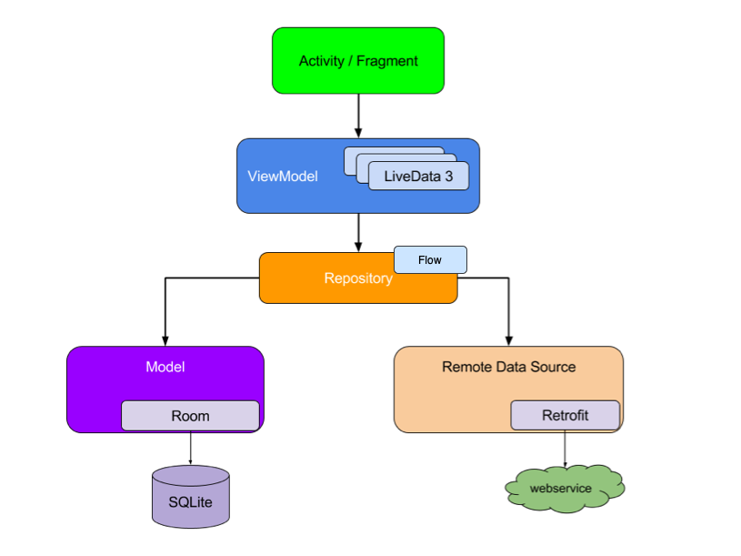

# Movie App 🎥 -  Android
This is a demo application built with the goal to create a fun and challenging application based on the MVVM architectural pattern using [The Movie Database TMDB API](https://www.themoviedb.org/documentation/api).
Used in Kotlin and Android Jetpack😍

See below for more information.✨

**NOTE:**
To get started put your API_Key in utils/Constants class before you run the app. Happy coding 😍

## Technologies 👀

✨ [Retrofit](https://square.github.io/retrofit/) & [Gson Converter](https://square.github.io/retrofit/)

✨ [Room Database](https://developer.android.com/jetpack/androidx/releases/room) 

✨ [Paging 3](https://developer.android.com/topic/libraries/architecture/paging/v3-overview)

✨ [Navigation](https://developer.android.com/guide/navigation/navigation-getting-started)

✨ [Coroutines](https://kotlinlang.org/docs/coroutines-overview.html)

✨ [Live Data](https://developer.android.com/topic/libraries/architecture/livedata)

✨ [Flow](https://developer.android.com/kotlin/flow)

✨ [Dependency injection with Hilt](https://developer.android.com/training/dependency-injection/hilt-android)

✨ [View Binding](https://developer.android.com/topic/libraries/view-binding)

✨ [Recycler View - DiffUtil](https://developer.android.com/reference/androidx/recyclerview/widget/DiffUtil)

## Features 👯

⭐ View the most popular, the top rated and the upcoming movies

💛 Save favorite movies

👎 Delete favorite movies

⭐ View movie details, casts, voting counts and similar movies

✋ Search movies and details

## Architecture 🔥

See below :

## Video 😇

